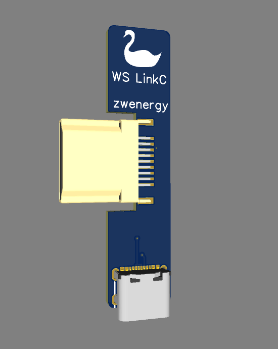
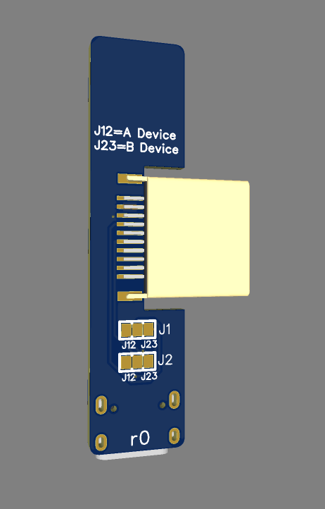

# WS LinkC
A link cable adapter for the WonderSwan which uses a USB-C cable.

## NEVER USE THIS ADAPTER TO CONNECT A WONDERSWAN TO A COMPUTER OR ANY OTHER USB-C DEVICE
The idea of this adapter is to have a cheap & DIY-friendly alternative to connect two WonderSwans together for multiplayer. **The USB-C connector is only used as a connector here, it has nothing to do with an actual USB connection**. You will easily destroy your WonderSwan, your computer (or whatever USB device connected) or both if you try to connect it to anything other. **Do not try it, there is no point in it.**

## Info
The WS LinkC is an adapter for the WonderSwan (Color) to use a USB-C cable to connect to WonderSwans together instead of the original proprietary one.

As the original link cable is crossed internally (and USB-C cables are not), this is done on the adapter. For this you need to bridge both jumper connections J12 on one adapter PCB (from here on called *Device A*) and J23 on the other (now called *Device B*).

**Never connect adapters which are set to the same jumpers. Never mix jumper settings on one PCB.**

Ah, and I forgot one point: **Never use this adapter to connect to a computer or other USB-C device.**

## Parts
| **Reference** | **Value**| **Links**
|---------------|----------|----------|
| AUDIO1        | Vertical HDMI male connector (1.6 mm board width) |[LCSC](https://lcsc.com/product-detail/D-Sub-DVI-HDMI-Connectors_Jing-Extension-of-the-Electronic-Co-920-867A2021Y10100_C168715.html)|
| USB1 | USB-C female connector |[LCSC](https://www.lcsc.com/product-detail/USB-Connectors_SHOU-HAN-TYPE-C-16PIN-2MD-073_C2765186.html)

## Images

## Connector Sleeve
In order to make the connector better fitting, I designed a sleeve for the HDMI connector which "extends" it physically to a WonderSwan EXT connector. It's 3D printable, you can find the STL here in the repo.

## Disclaimer
**Use the files and/or schematics to build your own adapter board at your own risk**.
This adapter works fine for me, but it's a simple hobby project, so there is no liability for errors in the schematics and/or board files.
**Use at your own risk**.
